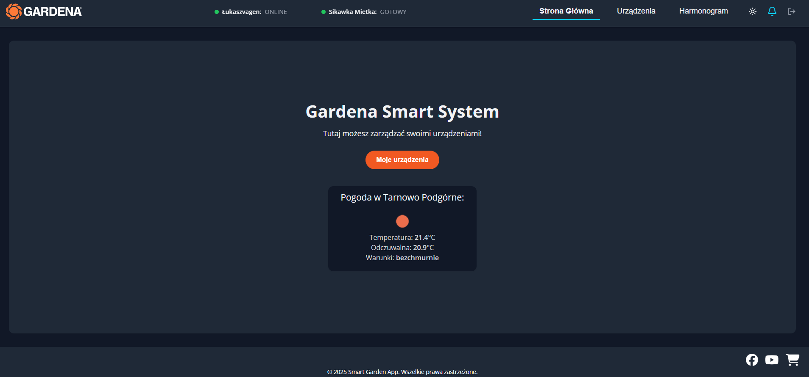
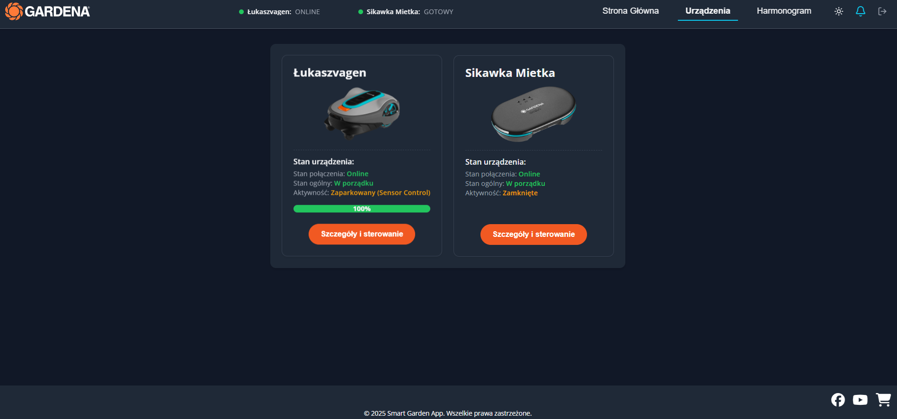
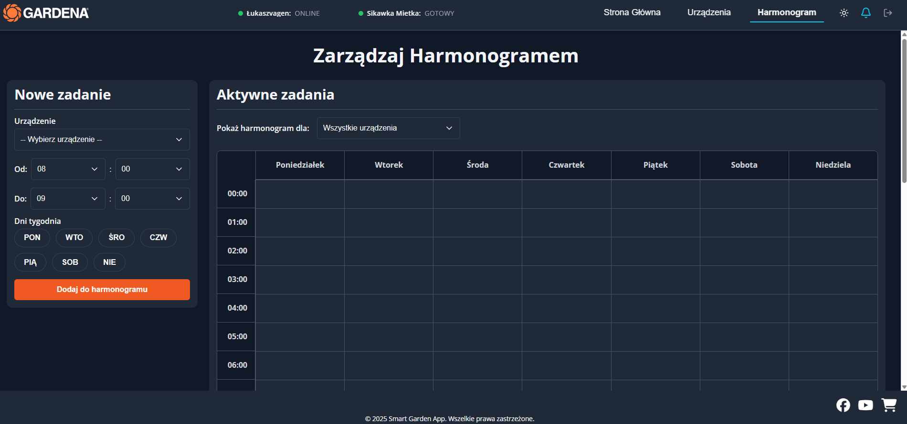

# Gardena Smart App - Centrum Dowodzenia

> Niestandardowa aplikacja webowa do zarządzania i monitorowania urządzeń z ekosystemu Gardena Smart System. Aplikacja oferuje interfejs czasu rzeczywistego, zaawansowane harmonogramy oraz integrację z danymi pogodowymi, stanowiąc kompletne centrum dowodzenia dla Twojego inteligentnego ogrodu.

---

## ✨ Główne Funkcje

- 🔐 **System uwierzytelniania** użytkowników oparty na sesji.
- 📊 **Dashboard w czasie rzeczywistym** z podglądem statusu wszystkich podłączonych urządzeń.
- 🤖 **Ręczne sterowanie kosiarką** (Start, Parkuj wg harmonogramu, Parkuj do odwołania).
- 💧 **Ręczne sterowanie nawadnianiem** (Uruchom, Zatrzymaj) dla poszczególnych zaworów.
- 🔌 **Zdalne włączanie/wyłączanie** inteligentnych gniazdek (Smart Plug).
- 🗓️ **Zaawansowany system harmonogramów** z wizualną siatką tygodniową i obsługą nakładających się zadań.
- ☀️ **Widget pogodowy** wyświetlający aktualne warunki dla lokalizacji użytkownika.
- 🎨 **Przełącznik motywów** (jasny/ciemny).
- 📱 **Pełna responsywność** interfejsu (RWD).

---

## 🛠️ Stos Technologiczny

Aplikacja zbudowana jest w architekturze monorepo, z oddzielonym frontendem i backendem.

#### **Frontend (w folderze `client`)**

- **Framework:** React
- **Bundler:** Vite
- **Routing:** React Router
- **Styling:** SCSS
- **Komunikacja z API:** Axios, WebSocket

#### **Backend (w folderze `server`)**

- **Środowisko:** Node.js
- **Framework:** Express.js
- **Komunikacja w czasie rzeczywistym:** `ws` (WebSocket)
- **Zadania CRON:** `node-schedule`
- **Bezpieczeństwo:** `bcryptjs` (hashowanie haseł), `express-session`
- **Baza danych:** Plik `db.json` do przechowywania harmonogramów

---

## 🏛️ Architektura API

Backend udostępnia REST API do zarządzania danymi. Główne endpointy to:

| Metoda   | Ścieżka                                  | Opis                                             |
| :------- | :--------------------------------------- | :----------------------------------------------- |
| `POST`   | `/api/login`                             | Logowanie użytkownika.                           |
| `GET`    | `/api/check-auth`                        | Sprawdza status uwierzytelnienia sesji.          |
| `GET`    | `/api/gardena/devices`                   | Pobiera listę wszystkich urządzeń z API Gardena. |
| `POST`   | `/api/gardena/devices/:deviceId/control` | Wysyła komendę sterującą do urządzenia.          |
| `GET`    | `/api/weather`                           | Pobiera aktualne dane pogodowe.                  |
| `GET`    | `/api/schedules`                         | Pobiera listę wszystkich harmonogramów.          |
| `POST`   | `/api/schedules`                         | Dodaje nowy harmonogram.                         |
| `PATCH`  | `/api/schedules/:id/toggle`              | Włącza lub wyłącza istniejący harmonogram.       |
| `DELETE` | `/api/schedules/:id`                     | Usuwa konkretny harmonogram.                     |

---

## 🚀 Uruchomienie Projektu

### Wymagania

- Node.js (wersja 18.x lub nowsza)
- npm (wersja 9.x lub nowsza)

### 1. Klonowanie Repozytorium

```bash
git clone <adres-twojego-repozytorium>
cd <nazwa-folderu-projektu>
```

### 2. Konfiguracja Zmiennych Środowiskowych

W folderze `server/` utwórz plik o nazwie `.env` i uzupełnij go swoimi kluczami API.

**Plik `server/.env`:**

```env
# Klucze API Gardena (Application Key i Application Secret)
GARDENA_CLIENT_ID=TWOJ_APPLICATION_KEY
GARDENA_CLIENT_SECRET=TWOJ_APPLICATION_SECRET
GARDENA_API_KEY=TWOJ_APPLICATION_KEY # Zazwyczaj jest taki sam jak CLIENT_ID

# Klucz API z OpenWeatherMap
OPENWEATHERMAP_API_KEY=TWOJ_KLUCZ_OPENWEATHERMAP

# Sekret dla sesji Express
SESSION_SECRET=wygeneruj_losowy_dlugi_ciag_znakow

# Adres przekierowania dla autoryzacji Gardena w trybie deweloperskim
GARDENA_REDIRECT_URI=http://localhost:3001/callback

# Port serwera
SERVER_PORT=3001

#Adres URL z Render.com
RENDER_FRONTEND_URL=adres-url-z-render-com
```

W folderze `client/` utwórz plik o nazwie `.env.development` i uzupełnij go adresem URL serwera backendowego.

**Plik `client/.env.development`:**

```env
# Adres URL serwera backendowego w trybie deweloperskim
VITE_BACKEND_URL=http://localhost:3001
```

### 3. Instalacja Zależności

Z głównego folderu projektu uruchom komendę, która zainstaluje zależności dla frontendu i backendu:

```bash
npm run install-all
```

### 4. Uruchomienie w Trybie Deweloperskim

Z głównego folderu projektu uruchom komendę, która jednocześnie uruchomi serwer backendowy (na porcie 3001) i serwer deweloperski Vite.

```bash
npm run dev
```

Aplikacja frontendowa będzie dostępna pod adresem `http://localhost:3000` (lub innym wskazanym w pliku konfiguracyjnym `vite.config.js`).

Dane do logowania:

Login: `admin`

Hasło: `admin123`

Dane do logowania można zmienić w pliku `server/index.js`.

## 🌐 Wdrożenie na Render.com

Projekt jest w pełni przygotowany do wdrożenia na darmowym planie platformy Render.com jako jeden Web Service, który obsługuje zarówno backend, jak i frontend.

### Konfiguracja Web Service

- **Root Directory**:

```bash
`Gardena Smart System/server`
```

- **Build Command**:

```bash
cd ../client && npm install && npm run build && cd ../server && npm install
```

- **Start Command**:

```bash
 npm start
```

- **Health Check Path**:

```bash
 `/healthz`
```

- **Zmienne środowiskowe**: Przepisz wszystkie zmienne z pliku `server.env` do zakładki "Environment" w ustawieniach usługi. Nie dodawaj`VITE_BACKEND_URL`.

---

## 📂 Struktura Projektu

Projekt jest zorganizowany jako monorepo z dwoma głównymi obszarami roboczymi:

- `/client`: Zawiera całą aplikację frontendową stworzoną w React.
- `/server`: Zawiera całą aplikację backendową stworzoną w Node.js/Express.

Główny plik `package.json` w katalogu nadrzędnym służy do zarządzania oboma projektami.

## 📜 Dostępne Skrypty

Wszystkie skrypty należy uruchamiać z **głównego folderu projektu -> `Gardena Smart System`**.

| Skrypt                | Opis                                                                  |
| :-------------------- | :-------------------------------------------------------------------- |
| `npm run install-all` | Instaluje wszystkie zależności w obu obszarach (`client` i `server`). |
| `npm run dev`         | Uruchamia jednocześnie backend i frontend w trybie deweloperskim.     |
| `npm run dev:client`  | Uruchamia tylko serwer deweloperski frontendu (Vite).                 |
| `npm run dev:server`  | Uruchamia tylko serwer backendowy z `nodemon`.                        |
| `npm run start`       | Uruchamia serwer backendowy w trybie produkcyjnym.                    |

---

## Podgląd aplikacji




